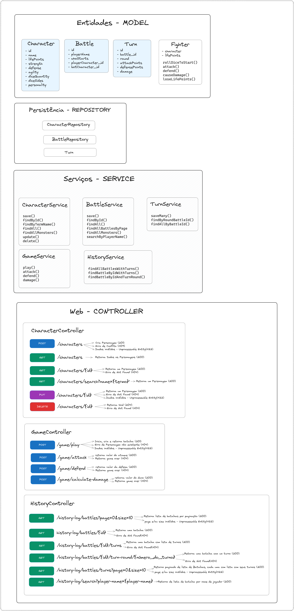

# DICE OF DESTINY - Jogo de RPG com API Rest

Este aplicativo é um jogo de interpretação de papéis (RPG) de batalhas épicas estilo Advanced Dungeons & Dragons (AD&D). Nele, a pessoa jogadora pode escolher entre se tornar um herói ou um monstro e se envolver em duelos estratégicos em turnos contra um monstro escolhido ou aleatório. O objetivo é derrotar o oponente, reduzindo seus pontos de vida (PV) a zero.

## Fluxo do jogo:

- **Seleção de Personagem:** Escolha seu personagem favorito entre heróis e monstros, cada um com atributos únicos que afetam o desempenho em batalha.

- **Seleção de Personagem Rival:** Escolha qualquer personagem para ser seu rival, caso não queira escolher, um monstro aleatório será escolhido por você.

- **Pontos de Vida (PV):** Cada personagem possui pontos de vida (PV) que representam sua resistência na batalha. O jogo termina quando um personagem fica com zero ou menos PV.

- **Iniciativa:** Descubra quem terá a iniciativa no início do jogo lançando um dado de 20 faces. O jogador com o maior resultado começará atacando e posteriormente os papéis serão alternados.

- **Turno - Ataque e Defesa:** Cada turno é dividido em duas partes: Ataque e Defesa. Durante o Ataque, você lançará um dado de 12 faces e somará sua Força e Agilidade para determinar o poder do ataque. Na Defesa, você lançará novamente um dado de 12 faces e somará Defesa e Agilidade. Se o ataque for maior que a defesa, o dano será calculado.

- **Cálculo de Dano:** O dano causado depende primeiramente da diferença entre o ataque e a defesa calculados no item anteior. Caso a defesa seja maior que o ataque, o dano final a ser subtraído dos pontos de vida do atacado é calculado pelo valor sorteado pelos dados específicos do atacante somado à sua Força.

- **Histórico de Batalha:** Todas as batalhas são registradas em um log, incluindo informações sobre o jogador, os personagens envolvidos, informações de ataque, defesa e dano de cada turno e outros detalhes importantes.

- **Endpoints da API:** A API oferece endpoints para realizar ações no jogo, incluindo inicar batalha, ataques, defesas, cálculos de dano e gerenciamento de personagens (Create, Read, Update e Delete).


## Requisitos
- Java 17 ou acima
- Docker (docker compose)
- Git
- Maven

## Como Usar

1. Clone este repositório para o seu ambiente de desenvolvimento.

2. A aplicação utiliza banco de dados PostGreSQL, que você pode subir em ambiente 'dockerizado':
   - Rode o comando `docker-compose up -d` para subir o containers de banco

3. Execute o projeto
4. O projeto estará disponivel em: http://localhost:8080/docs-rpg/swagger-ui/index.html

## Como jogar

1. A aplicação já sobe com o banco de dados populado com alguns personagens, no entanto, você pode criar seus próprios 
personagens (http://localhost:8080/docs-rpg/swagger-ui/index.html#/character-controller/create)
2. Para escolher os personagens, você pode listá-los e visualizar os detalhes de cada um (http://localhost:8080/docs-rpg/swagger-ui/index.html#/character-controller/getAll)
3. Para iniciar o jogo, coloque seu nome, o id do seu personagem e você pode ou não escolher o seu rival (http://localhost:8080/docs-rpg/swagger-ui/index.html#/game-controller/play). Caso
não escolha um rival, um Monstro será sorteado para duelar com você.
4. Nesta aplicação, logo que um jogo inicia, toda a batalha acontece. Esta é uma solução de prioriza a redução de acesso ao banco, uma vez que todos os turnos são salvos de uma vez.
4. Para atacar (ver as informações de ataque) informe em qual batalha e em quando round está (http://localhost:8080/docs-rpg/swagger-ui/index.html#/game-controller/attack)
5. Para defender (ver as informações de defesa) informe a batalha e o round(http://localhost:8080/docs-rpg/swagger-ui/index.html#/game-controller/defense)
6. Para saber o dano (ver as informações de dano), informe a batalha e o round(http://localhost:8080/docs-rpg/swagger-ui/index.html#/game-controller/damage)
7. Caso queira ver os informções de cada batalha e turnos, pode ver as opções de visualização de logs de batalhas (http://localhost:8080/docs-rpg/swagger-ui/index.html#/history-controller)

## Exemplos de alguns endpoints

### Crie um novo personagem

```
POST http://localhost:8080/characters
Accept: application/json
Content-Type: application/json

{
  "name": "Elementista",
  "lifePoints": 10,
  "strength": 15,
  "defense": 2,
  "agility": 5,
  "diceQuantity": 3,
  "diceSides": 4,
  "personality": "HERO"
}

RESPONSE: HTTP 201 (Created)
Location header:  http://localhost:8080/characters/1
Content: Personagem
```

### Requisite informações de todos os Personagens

```
http://localhost:8080/characters
```

### Busque personagens por nome ou parte do nome

```
http://localhost:8080/characters/search?name=eiro

Response: HTTP 200
Content: Lista de Personagens
``` 

### Inicie uma batalha

```
POST http://localhost:8080/game/play
Accept: application/json
Content-Type: application/json

{
  "playerName": "Camila",
  "playerCharacterId": 1,
  "botCharacterId": 5
}

Response: HTTP 201
Location header: http://localhost:8080/battles/1
Content: Batalha
``` 

### Requisite um ataque em uma batalha

```
POST http://localhost:8080/game/attack
Accept: application/json
Content-Type: application/json

{
  "battleId": 1,
  "round": 1
}

Response: HTTP 200
Content: Valor do ataque
``` 

### Recupere uma batalha com detalhes dos turnos

```
http://localhost:8080/history-log/battles/1
Response: HTTP 200
Content: Batalha com lista de turnos
``` 


### Recupere uma lista paginada de batalhas

```
http://localhost:8080/history-log/battles?page=0&size=10
Response: HTTP 200
Content: Lista paginada
``` 

### Recupere as batalhas por nome de jogador

```
http://localhost:8080/history-log/search?player-name=camila

Response: HTTP 200
Content: Lista de batalhas 
```

## A aplicação foi desenvolvida utilizando arquitetura em camadas: 

### As principais camadas podem ser visualizadas no diagrama: 



## Testes automatizados

Para os testes, foi utilizado o banco de dados em memória H2 com as mesmas entidades 
do banco da aplicação. Foi feita a inserção de dados no início de cada
método de teste e remoção de dados após o término do método.

### Testes de Ponta-a-ponta

Até o momento foram implementados testes de ponta-a-ponta para
os endpoints de gestão de Personagens e para os endpoints
de Jogo (play, atacar, defender e calcular dano). Como próximos testes, será priorizada a
implementação de testes de ponta-a-ponta dos endpoints dos logs de batalhas. 

### Demais testes
Posteriormente, serão implementados testes unitário e demais testes de integração.